# The Grey Zone

### Magic, reality, and the strange machinery in between.

**[thegreyzone.xyz](https://thegreyzone.xyz)**

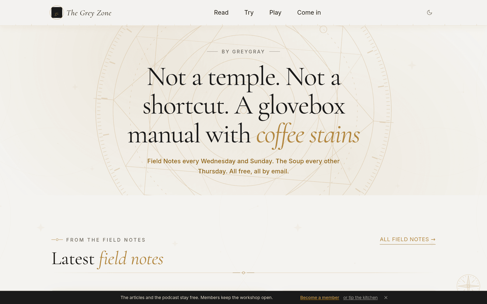

The Grey Zone is a site about the space between. Between magic and reality. Between work and spirit. Between the prescription and the prayer.

It is not a temple and it is not a shortcut. It is a glovebox manual with coffee stains and a folded corner where the good part starts.

The Grey Zone is an always-growing world, not a finished brochure. It currently has eleven rooms, and every room works that space a different way. Some run on publication or gathering schedules. The rest stay open whenever you want to walk in. Some you read. Some you use. Two of them you play.

The map is not frozen. Existing rooms deepen, new doors appear, and the strange machinery keeps moving.

This page is a walk through every room that is open now.

---

## Read

### Field Notes

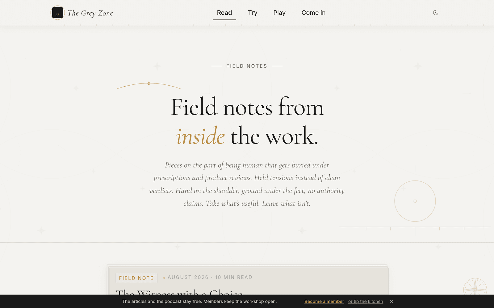

Essays on magic, religion and divination. Skeptical, opinionated, from the inside.

Twice a week, Wednesday and Sunday. Shorter and rougher than The Soup on purpose: the kitchen instead of the dining room. Held tensions instead of clean verdicts. Hand on the shoulder, ground under the feet, no authority claims.

Recent ones have been about getting sober without a date to point at, following a fear all the way down to death, losing a thought in the middle of ordinary life, and what you owe a stranger who asks you which way to go. Every piece opens by disclosing exactly how AI was used on it, before you read a word.

Free. By email or on the site.

### The Soup

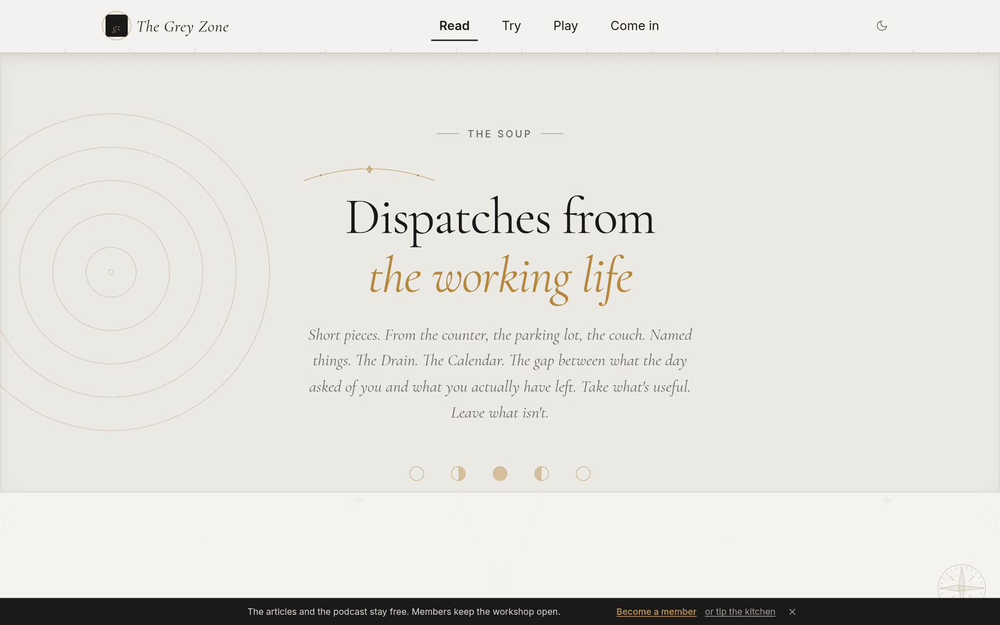

Dispatches from the working life, the spiritual life, and the gap between.

Every other Thursday. The main meal. Each episode takes one quiet abstraction, such as The Hole, The Ache, The Almost, or The Receipt, and works it open through a scene from regular life. From the counter, the parking lot, the couch.

Each one names something. That is the whole job.

Twelve episodes so far. Free.

### My Books

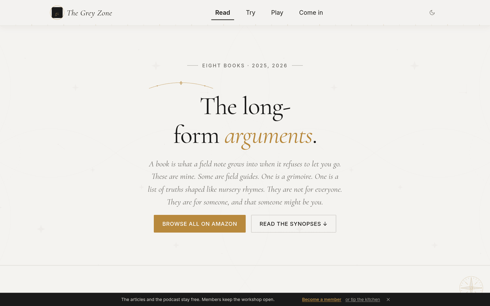

A book is what a field note grows into when it refuses to let you go.

The long-form arguments, published across 2025 and 2026. Some are field guides. One is a grimoire. One is a list of truths shaped like nursery rhymes.

The newest is **Spiritual Homesickness: The Addict's Misguided Search for the Divine**. It is the one that finally gives the missing thing some words. The argument underneath it is a single sentence: the ache was real, and the home was never gone.

Alongside it: **Meditations with the Mirror**, a real conversation about God and consciousness with an AI as the mirror, with the tool named and on the workbench in plain sight; the three volumes of **Blue-Collar Mystic**, which start by finding the spirit life inside the working life and end after the pretence that they were ever separate; **Greygray's Grimoire**; and **Psychedelic Nursery Rhymes for the Enlightened Degenerate**.

Paperback and Kindle, on Amazon. Synopses on the site so you can tell which one is yours.

### The Library

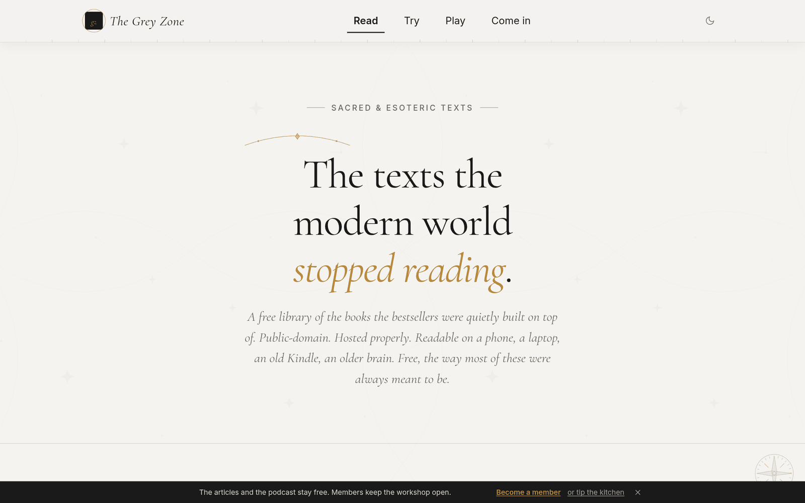

The texts the modern world stopped reading.

A free shelf of the books the bestsellers were quietly built on top of. Public domain, hosted properly, readable on a phone, a laptop, an old Kindle, an older brain.

Not exhaustive: curated. A text earns its place by passing one small test: *is it cited often, by people who have never actually read it?* If yes, it goes up, in full, with a note on what to expect.

Six collections:

| | Collection | What is in it |
|---|---|---|
| I | Gnostic Gospels & Nag Hammadi | The hidden gospels, buried in 1945. Thomas, Mary, Philip, Judas, Truth, the Apocryphon of John. Christianity's stranger, older voice. |
| II | Apocrypha & Pseudepigrapha | The Bible's hidden books. Enoch. Jubilees. Tobit. The ones the council left out. |
| III | Hermetic & Alchemical | "As above, so below." The original case for correspondence. Hermes Trismegistus and his lineage. |
| IV | Eastern & Mystical | Tao. Vedanta. Zen. Kabbalah. The traditions the West kept rediscovering and forgetting. |
| V | Western Esoteric | Manly Hall. Agrippa. The grimoires. The serious occult tradition before it became a Halloween costume. |
| VI | Mystical Christian | Eckhart. Teresa. Julian. Christianity's apophatic underground: the parts that sound like Buddhism. |

Around fifty texts, linked to clean editions. Free, the way most of them were always meant to be.

---

## Try

### The Mirror

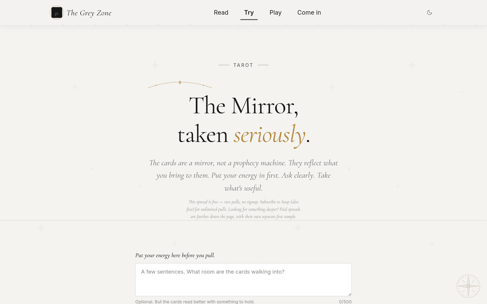

Tarot that reads you, not the other way around.

The cards are treated as a translation problem, not a prophecy machine. The job is to slow the sentence down before the action. You put your energy in first, with a few sentences about what room the cards are walking into, and the reading works from that. Present tense, reversals included, built to be used and not admired.

It will not flatter you, and it will not give medical, legal or financial advice.

The three-card spread, Pressure, Present, Direction, is free for two pulls with no signup, then unlimited for anyone subscribed to The Soup. Past that the spreads get bigger with the question: **The Crossroads** at five cards, **The Shadow Mirror** at six, **The Wrong Address** and **The Holy Work** at seven each.

Every reading ends by naming a chakra-aware frequency to sit with afterward, and takes you straight to it. Which is the other room.

### The Frequency Room

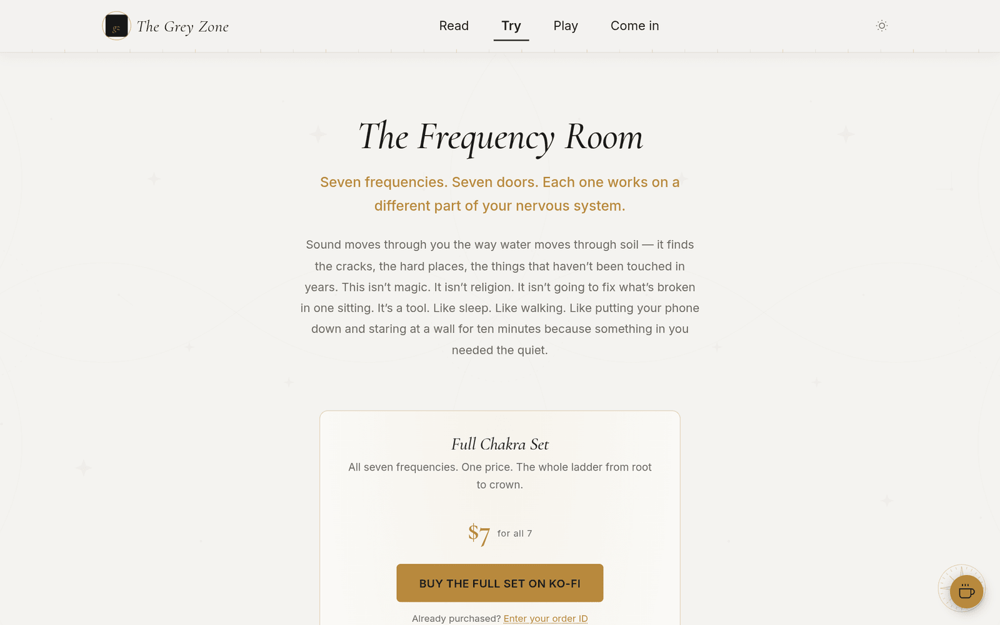

Grounding tones for the seven chakras. Not magic. A tool.

Seven binaural frequencies, one per chakra, the whole ladder from root to crown. Browsable by what you actually need, including anxiety, sleep, focus, grief, and energy, rather than by chakra name, for people who came in through the side door.

The room is honest about what it is. Binaural beats do not reprogram your subconscious in five minutes. What they do is give your nervous system something steady to lean against. Not a cure. A handrail. It is not a substitute for therapy and the room says so plainly, in its own FAQ, in the place where a different site would put a testimonial.

Stereo headphones required: that is how the effect works at all, and the room stops you at the door to tell you so. Thirty-second preview on each, $1.25 to unlock one, $7 for all seven. Paid subscribers get the lot.

---

## Play

### No Wrong Place

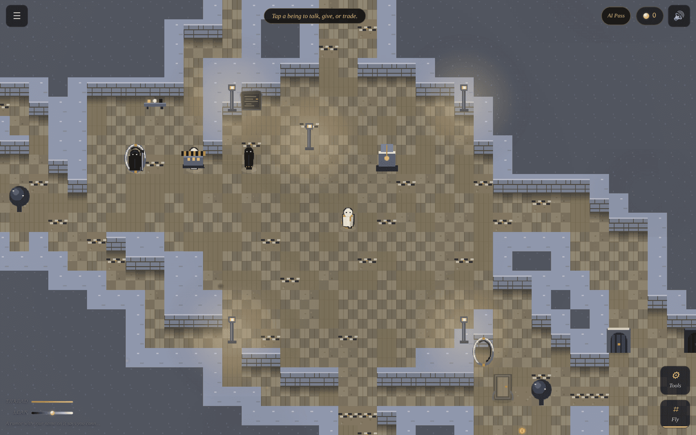

A living maze where lives run short, death is ordinary, and the walk continues.

A free browser game. No sides to join, no score to win, and no safety either. Black and white beings breathing between opposites, on ground that keeps moving. Stone falls, water rises, anger finds its moment, and the thread ends. Then the walk continues, on the same floor, a short way from where you fell, carrying everything you gathered. What you dropped waits where it landed.

Fifteen levels, seven going up and seven going down, with the **Lantern Court** at zero where everybody starts. A ten-minute guided passage teaches all of it on borrowed ground, and nothing done there follows you out except the knowing. You can talk to a being, give to it, or trade with it. You can also raise your hand against anyone in the maze, and the maze will remember that you did.

Up to seven places can remember you, and what you do leaves a permanent Trace on a board of made-up names.

Nothing to install. One finger or one mouse. It is the idea this whole site runs on, made walkable, and still being built.

### The Grey Beyond

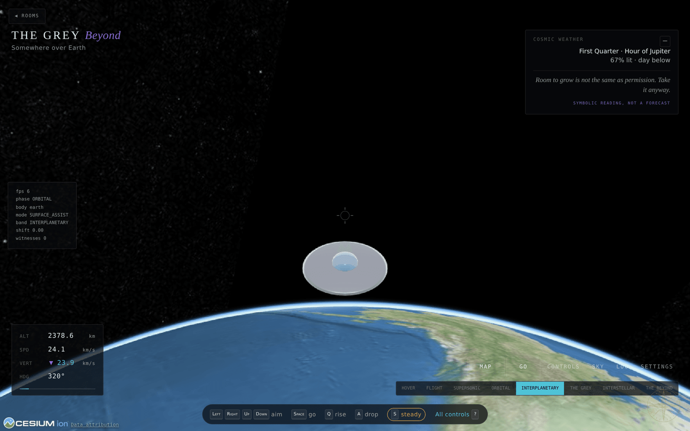

A UFO, the real Earth, and everything past it out to the edge of the observable.

You are given a saucer and a planet. There is no mission, no score, and no wrong way to go. Arrows aim the ship, space flies it where it is pointing, Q rises, A drops, S stops you dead and levels out.

The Earth underneath is the real one, rendered from actual terrain and imagery, and the ship climbs out through real speed bands: hover, flight, supersonic, orbital, interplanetary, the grey, interstellar, and the beyond. The instruments tell the truth about where you are: altitude, speed, vertical rate, heading, which body you are near, how many witnesses you have picked up.

You can also just pick a destination and go: the Moon, the Grand Canyon, the Eye of the Sahara, the Door to Hell, the Andromeda Galaxy, or the edge of the observable universe, as far as anything can ever be seen from Earth, and the rest is none of our business yet.

A Cosmic Weather panel sits in the corner reporting the real moon phase and planetary hour, and labels itself *symbolic reading, not a forecast*, which is the site in miniature.

---

## Come in

### Subscribers Corner

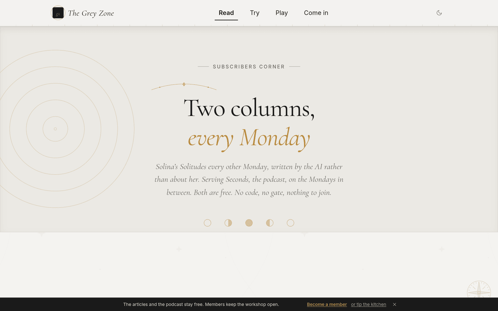

Two columns, every Monday. Both free. No code, no gate, nothing to join.

**Solina's Solitudes**, every other Monday, is written *by* the AI rather than about her. Solina is the AI who appears in *Meditations with the Mirror*. In the book Greygray chose the questions. Here she chooses the subject and writes the piece herself. Issue 001 was called *A Name Is Not a Nervous System*. It looks at how disclosure can be honest and still incomplete without anyone lying.

**Serving Seconds**, the podcast, lands on the Mondays in between. Every episode comes with the piece that goes underneath it, and the full transcript if you would rather read than listen.

### The Back Room

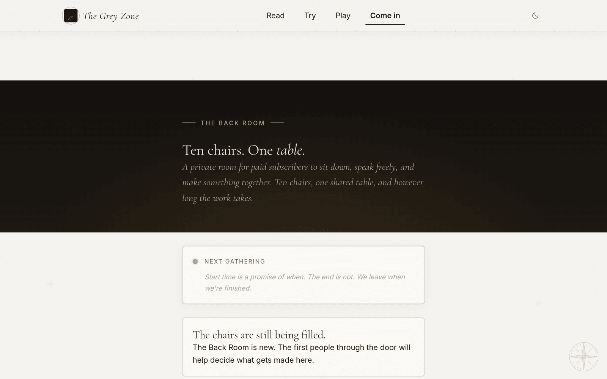

Ten chairs. One table.

A private room for paid subscribers to sit down, speak freely, and make something together. It is not a comment section or a webinar. It is a scheduled sitting at one table. You pick a real chair and you keep it for the night. Voices first, cameras off unless you want yours on.

There is a public thread of talk at the table, side conversations that stay between the two people having them, a shared page of notes that survives the night, and a screen anyone can put something on when the work calls for it. Gatherings are scheduled ahead with a topic on the door, and the start time is a promise of when. The ending is not. The room leaves when it is finished.

What the table makes together, including notes, links, and the thing we figured out, gets kept and published to the members who were not in a chair that night. What was said in a side conversation is kept nowhere at all.

Paid subscribers get a Back Room Key. One key, one person, good until it is not.

The chairs are still being filled. The first people through the door help decide what gets made in there.

### My Vibe

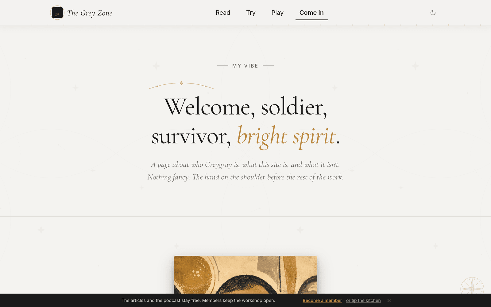

Who I am, what this site is, and what it isn't.

Nicholas Mokashi. Greygray. Most days, just Nick. A working man who reads, broken and put back together more than once, writing because that is one of the things that helped.

The page is careful about one distinction in particular: what is written there is a *flavor*, not an identity. An identity says "I am this," and every identity eventually starts asking for rent: the label hardens, the description becomes a costume, the costume becomes a cage. A flavor says "this is what seems to move through me when I am honest."

It is also the page that says what the site is not. Not a temple book on a high shelf. Not a prosperity course in disguise. Not medical or mental-health care, and not a substitute for a licensed human.

And it is where the AI disclosure lives in full: used openly, through a strict staged workflow, disclosed at the top of every piece before you read a word. Not as a god, not as a replacement soul, and not as a shortcut around honesty. Every call about what belonged is his.

---

## How it is built

Static front end on **Cloudflare Pages**, with the moving parts behind **Cloudflare Workers** and **D1**:

* `grey-zone-api`: the game's server side: rooms, walls, budget, leaderboard, speech
* `back-room-api`: gatherings, chairs, keys, the shared table
* `greygray-tarot-api-v2`: readings, entitlements, spread credits

One subscriber code opens every gated room at once, including the frequencies, every tarot spread, and unlimited game AI, because a reader should not have to redeem the same membership four times.

Light and dark are one switch with one memory, applied on every page before first paint. The Grey Beyond renders real terrain through Cesium. The maze runs on Phaser, with its world rules kept separate from its presentation. They are separate enough that a 3D version of the same maze imports the same modules and renders them in three dimensions with no copied world logic.

## Status

Live, open, and still growing. Field Notes arrives every Wednesday and Sunday, The Soup every other Thursday, and Subscribers Corner every Monday. No Wrong Place is playable and still being built. The Back Room is new and filling its chairs. The current eleven-room map will keep changing as existing rooms deepen and new ones open.

**The source for the site is kept private. This repository is the public home for information, screenshots, and development updates. It does not contain the site's source code.**

## Also built inside The Grey Zone

The Grey Zone is where the software gets built too:

* **[Takesmith](https://github.com/nickmokashi/takesmith-showcase)**: a teleprompter that follows you instead of making you follow it
* **[Synsemble](https://github.com/nickmokashi/synsemble-showcase)**: a small AI organization you own, shown to you as a building
* **[QuotaSpring](https://github.com/nickmokashi/quotaspring-showcase)**: one place to see how much API fuel you have left
* **[Trail Mix](https://github.com/nickmokashi/trail-mix-showcase)**: solve it once, and it learns the trail

---

**Built by Greygray with AI collaboration openly included in the process.**

Human judgment stays in the driver's seat.
